<!--
  ╔══════════════════════════════════════════════════════════════╗
  ║  PROFILE README — MEGAJava505                                  ║
  ║  Vibe: dark neon · teal/turquoise · minimal · animated         ║
  ║  Palette:  bg #0D1117 · accent #00E5C7 · text #9FEFE5          ║
  ║  Слева — стек, справа — статистика, снизу — изометрия.          ║
  ╚══════════════════════════════════════════════════════════════╝
-->

<!-- ░░░ ШАПКА (анимированная волна) ░░░ -->

  

<!-- ░░░ ПЕЧАТАЮЩИЙСЯ ТЕКСТ ░░░ -->

  

<!-- ░░░ ПРИВЕТСТВИЕ ░░░ -->
<h3 align="center">
  
  CS-студент, иду в Data Science
</h3>

  

 

<!-- ░░░ СЕТКА: СЛЕВА СТЕК · СПРАВА СТАТИСТИКА ░░░ -->
<table align="center" width="100%">
  <tr>
    <td width="50%" valign="top">
      <h3 align="center">🛠 Tech Stack</h3>
      

        
      

      
📚 Сейчас учу — Data Science · pandas · numpy · scikit-learn

    </td>
    <td width="50%" valign="top">
      <h3 align="center">📈 Stats</h3>
      

        
      

    </td>
  </tr>
  <tr>
    <td width="50%" valign="top">
      <h3 align="center">🧩 Most Used</h3>
      

        
      

    </td>
    <td width="50%" valign="top">
      <h3 align="center">🔥 Streak</h3>
      

        
      

    </td>
  </tr>
</table>

 

<!-- ░░░ ИЗОМЕТРИЧЕСКИЙ КАЛЕНДАРЬ ░░░
     Появится после прогона metrics.yml. До запуска ссылка битая — норма. -->
<h3 align="center">🗓 Isometric Activity</h3>

  

<!-- ░░░ ПОДВАЛ ░░░ -->

  

<!--
  ▼ ДОП-ПЛЮШКИ (необязательно). Раскомментируй, если захочешь.

  Трофеи:
  

    
  

  Случайная цитата:
  
-->
